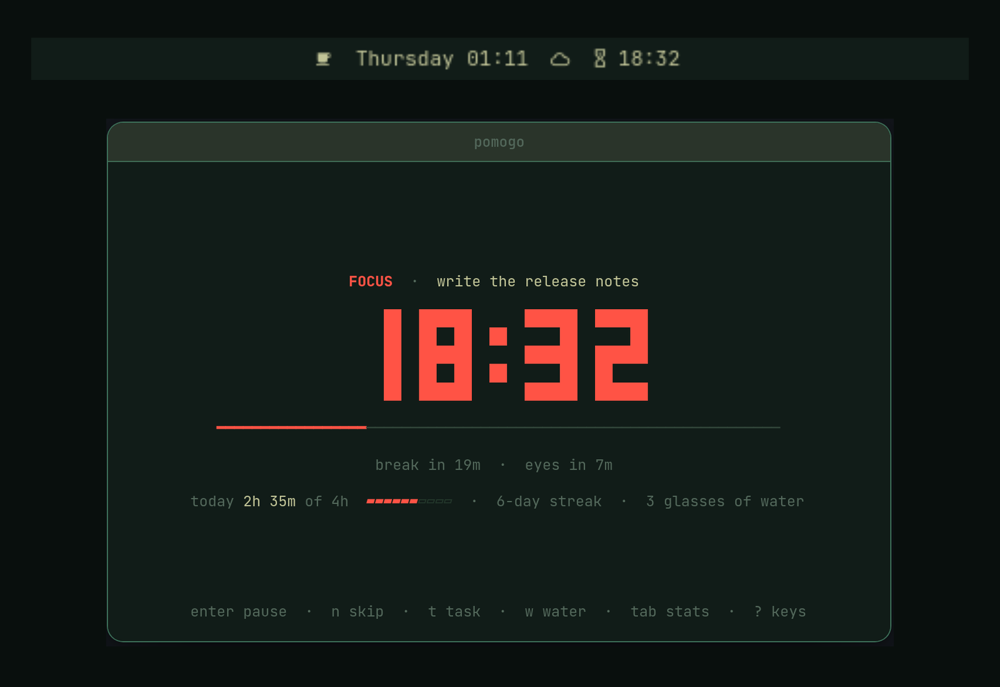

# PomoGo for the Omarchy bar

A bar widget for [PomoGo](https://github.com/Ibnu-Afdel/pomogo-rs), the
terminal focus companion: Pomodoro-style focus and breaks on autopilot,
reminders to rest your eyes, drink water and stretch, and a daily focus goal.



The widget shows the countdown of the running focus or break, dims while
paused, swaps its icon when PomoGo asks you to rest your eyes, drink water or
stretch, and hides itself when PomoGo is closed. Its tooltip shows the task
and today's progress toward your daily goal.

| Action | What it does |
|---|---|
| Click | Focus PomoGo's terminal (tmux included), or open PomoGo if it isn't running |
| Right click | Start, pause or resume |
| Middle click | Skip to the next focus or break |

## Requirements

- Omarchy 4 (omarchy-shell).
- The `pomogo` command, version 4.0.2 or newer, on your `PATH`. See the
  [PomoGo install instructions](https://github.com/Ibnu-Afdel/pomogo-rs#install).

The widget runs no code of its own besides reading PomoGo's state file and
calling `pomogo focus`, `pomogo toggle`, `pomogo skip` and
`omarchy-launch-or-focus-tui pomogo` when you click it.

## Install

```sh
omarchy plugin add https://github.com/Ibnu-Afdel/omarchy-pomogo.git --enable
```

It lands in the center of the bar. Move it with:

```sh
omarchy bar move pomogo.timer --section right
```

Its settings (icon only or icon and time, show the task name, show the widget
while PomoGo is idle) are in Omarchy's bar settings. With icon only, hover it
for the time left. If you have PomoGo installed, `pomogo omarchy install`
does the same as the `omarchy plugin add` command above.

## Update

```sh
omarchy plugin update pomogo.timer
```

If the bar keeps showing the old version, run `omarchy restart shell`.

## Remove

```sh
omarchy plugin remove pomogo.timer
```

This takes the widget out of the bar and deletes its folder. PomoGo itself
and your session history are untouched.

## How it works

While PomoGo is open it rewrites `$XDG_RUNTIME_DIR/pomogo/state.json` every
second. The widget reads that file and hides once the updates stop, so a
closed or crashed PomoGo never leaves a frozen timer in the bar.

This repository is generated from `contrib/omarchy/plugin` in the PomoGo
repository; please send issues and changes there.

## License

MIT
